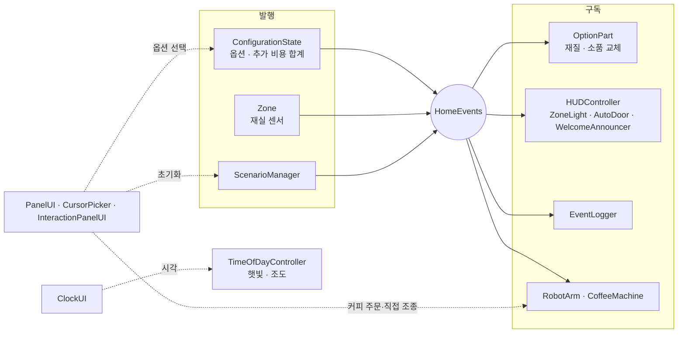

# 스마트 모델하우스 컨피규레이터

> Asset Store 에셋 Modern Apartment로 꾸민 개방형 아파트를 1인칭으로 걸으며, 기본 에셋에서 벽지·바닥재·주방 상판과 소파·러그·그림·화분을 바꾸면 추가 비용이 붙는 Unity 컨피규레이터.
> 시계 바늘을 돌려 시간대별 햇빛과 실내 조도를 보고, 주방의 커피 로봇팔이 컵을 커피 머신에 놓았다가 식탁으로 가져다준다.

<!-- 시연 영상: 10/14 추가 -->
<!-- [](유튜브 링크) -->

| 항목 | 내용 |
| --- | --- |
| 팀 | COM (2인) |
| 기간 | 2026.10.06 ~ 2026.10.14 (10/13 12:30 기능 동결, 10/14 발표) |
| 엔진 | Unity `6000.4.0f1` (두 사람 같은 버전) |
| 렌더링 | URP (Forward+, 간접광 굽기 Baked Indirect, 반사 프로브, 포스트 프로세싱 Volume) |
| 언어 | C# |
| 공간 에셋 | [Modern Apartment](https://assetstore.unity.com/packages/3d/props/interior/modern-apartment-375248) (Zeps3D, $16.99, URP 전용) — 저장소에 포함하지 않음, 각자 구매 후 Import |
| 플랫폼 | Windows 10/11 (64비트) |
| 요구사항 | [SRS v1.7](docs/SRS_COM_v1.7.docx) — 20개 (Must 16, Should 1, Could 3) |

---

## 팀과 역할

| 이름 | 역할 | 담당 | 핵심 기능 |
| --- | --- | --- | --- |
| 권오민 | 팀장 | 공간·옵션 표현·UI | 1인칭 투어, 벽지·소품 옵션, 시계 UI, 좌측 상단 메뉴와 상호작용 창 |
| 김찬중 | 팀원 · 기술 리드 | 이벤트·옵션 규칙·로봇팔·시간대 | 커피 로봇(IK), 시간대별 햇빛과 조도, 추가 비용 합계 |

---

## 주요 기능

- [ ] 1인칭 이동과 구역 정보 표시 (현관·거실·주방·침실) — FR-01, FR-02
- [ ] 부분 클릭 옵션: 벽·바닥·주방 상판·소파·러그·그림·화분을 클릭하면 옵션 목록 — FR-03
- [ ] 옵션 적용과 기본 대비 추가 비용 합계 — FR-29, FR-31
- [ ] 시계: 시침을 끌어 1시간 단위로 시각 변경 → 햇빛·하늘·조도(lx) 변경 — FR-30
- [ ] 재실 감지 조명, 중문 자동 개폐, 웰컴 음성 — FR-04, FR-05, FR-07, FR-08
- [ ] 좌측 상단 메뉴 [옵션] [기록] [초기화] — FR-11
- [ ] 커피 로봇: 식탁 컵 → 커피 머신(5초 추출) → 식탁 — FR-13, FR-15
- [ ] 로봇팔 상호작용 창 [커피 만들기] [직접 조종] — FR-34 (직접 조종 FR-33은 Should)
- [ ] 이벤트 기록(밀리초), 초기화(고른 옵션은 유지) — FR-25, FR-26

### 옵션과 추가 비용 (예시 금액, SRS 부록 A-7)

| 부분 | 에셋 재질·프리팹 | 선택지 |
| --- | --- | --- |
| 벽지 | `m_walls` | 화이트 페인트(기본), 그레이지 실크 +40만, 세이지 그린 실크 +40만, 패브릭 질감 +70만 |
| 바닥재 | `m_floor` | 원목 마루(기본), 밝은 강마루 +150만, 대리석 타일 +320만 |
| 주방 상판 | `m_countertop` | 화이트(기본), 다크 스톤 +180만 |
| 소파 패브릭 | `m_white_fabric` | 화이트(기본), 웜 그레이 +30만, 네이비 +30만 |
| 러그 | `m_carpet` | 기본, 베이지 울 +25만, 차콜 +25만 |
| 그림 액자 | `sm_painting` 1~3 | 기본, 다른 그림 2종 각 +15만 |
| 화분 | `sm_strelitzia`, `sm_plant_fern`, `sm_broadleaf` | 기본, 다른 화분 2종 각 +8만 |

---

## 조작법

| 입력 | 동작 |
| --- | --- |
| W A S D | 이동 (바라보는 방향 기준) |
| 마우스 오른쪽 버튼 누른 채 끌기 | 시점 회전 |
| 마우스 왼쪽 클릭 | 버튼, 옵션 부분(옵션 목록), 식탁 컵(커피 주문), 로봇팔·커피 머신(상호작용 창) |
| 좌측 상단 메뉴 | [옵션] [기록] [초기화] |
| 우측 상단 시계 | 시침을 끌어 시각 변경 |

---

## 구조

옵션 선택과 센서는 `HomeEvents`(중앙 이벤트 관리자)에 알리기만 하고, 재질·소품·조명·UI는 `HomeEvents`를 구독만 한다. 커피 로봇과 시계는 화면에서 직접 호출한다.



### 폴더 구조

```
Assets/_Project/
├── Scenes/        Main.unity (권오민), Test_RobotArm.unity (김찬중)
├── Scripts/
│   ├── Core/      HomeEvents, Zone, ZoneData, ScenarioManager
│   ├── Player/    PlayerController (1인칭), CursorPicker
│   ├── Options/   OptionCatalog, ConfigurationState, OptionPart, TimeOfDayController
│   ├── Devices/   AutoDoor, ZoneLight, WelcomeAnnouncer, CoffeeMachine
│   ├── RobotArm/  RobotArm, ArmTask, CoffeeTask, TeachPendant
│   └── UI/        HUDController, PanelUI, ClockUI, InteractionPanelUI, EventLogger
├── Prefabs/
├── Data/          ZoneData 에셋 4개, OptionCatalog 에셋
├── Materials/     옵션용 복제 재질 (에셋 원본 재질은 고치지 않음)
└── Audio/
Assets/ThirdParty/ Asset Store 에셋 (.gitignore로 제외)
```

---

## 개발 환경 세팅

### 처음 만드는 사람 (김찬중)

1. GitHub에서 빈 저장소 `com-smart-modelhouse` 생성 (README, .gitignore 추가 체크 해제)
2. Unity Hub → Unity `6000.4.0f1` 설치 → New project → **Universal 3D** → 이름 `com-smart-modelhouse`
3. 이 README, `.gitignore`, `.gitattributes`를 프로젝트 루트(`Assets` 폴더 옆)에 복사, `docs/SRS_COM_v1.7.docx` 추가
4. Edit → Project Settings → Editor
   - Version Control → Mode: **Visible Meta Files**
   - Asset Serialization → Mode: **Force Text**
5. Window → Package Manager → Input System, Cinemachine, ProBuilder, Animation Rigging 설치
6. Asset Store에서 **Modern Apartment**(Zeps3D)를 각자 구매 → Package Manager → My Assets → Import, Project 창에서 `Assets/Zeps3D`를 `Assets/ThirdParty/` 아래로 옮김
   - 데모 씬 라이트맵은 우리 씬에서 다시 굽는다
   - 커피 머신과 머그컵은 에셋에 없으므로 ProBuilder로 만든다
7. URP 설정: Rendering Path = Forward+, 고정 물체는 Static + 간접광만 굽기(Mixed, Baked Indirect), 구역마다 Reflection Probe, Global Volume(Tonemapping ACES, Bloom, SSAO). 햇빛은 시계로 실시간 변경
8. 첫 커밋

```bash
cd com-smart-modelhouse
git init
git status                 # Library/, Temp/, Assets/ThirdParty/ 가 목록에 없는지 확인
git add .
git commit -m "chore: Unity 프로젝트 초기 설정 및 README"
git branch -M main
git remote add origin https://github.com/<계정>/com-smart-modelhouse.git
git push -u origin main
```

9. Settings → Collaborators → 권오민 초대

### 받아서 여는 사람 (권오민)

```bash
git clone https://github.com/<계정>/com-smart-modelhouse.git
```

Unity Hub → Add → Add project from disk → 클론한 폴더 선택 (Unity `6000.4.0f1`), Modern Apartment는 각자 Import

---

## 협업 규칙

| 항목 | 규칙 | 예 |
| --- | --- | --- |
| 브랜치 | `main`은 항상 실행되는 상태. 기능은 `feature/이름-기능`에서 작업 후 PR | `feature/chanjung-coffee-robot` |
| 커밋 | `타입: FR번호 한 줄 요약` (feat, fix, refactor, docs, chore) | `feat: FR-13 커피 로봇 컵 옮기기` |
| 리뷰 | PR은 상대방이 리뷰 후 머지. 오너가 설명하지 못하는 코드는 미완성 | |
| 씬 | `Main.unity`는 권오민만 수정. 김찬중은 프리팹·`Test_RobotArm.unity`에서 작업 | |
| 마감 | 매일 19:00 기록 공유 전에 PR 머지 | |

---

## 일정

작업 가능 시간: 09:30 ~ 19:10 (점심 12:20 ~ 13:20)

| 날짜 | 단계 | 끝나면 있어야 할 것 |
| --- | --- | --- |
| 10/6 (화) | 기획·설계 | 기획서, 클래스 설계, SRS |
| 10/7 (수) | 에셋·씬 구축 | Modern Apartment 임포트, 4구역, 조명 굽기, 로봇팔 리그, 빈 스크립트 |
| 10/8 (목) | 기능 구현 1 | 핵심 3개: 1인칭 이동, 벽지 옵션 바꾸기, 커피 로봇 |
| 10/12 (월) | 기능 구현 2 | Must 16개 전부 동작 (MVP), 팀 간 플레이테스트 |
| 10/13 (화) | 폴리싱·빌드 | 12:30 기능 동결, 빌드 테스트 1 |
| 10/14 (수) | 발표 | 빌드 테스트 2, README·시연 영상, 발표, 회고 |

---

## 트러블슈팅

| 날짜 | 문제 | 원인 | 해결 |
| --- | --- | --- | --- |
| | | | |

---

## 코드 리뷰 · 멘토링 기록

| 날짜 | PR / 주제 | 리뷰 내용 | 결과 |
| --- | --- | --- | --- |
| | | | |

---

## 회고

<!-- 10/14 작성: 잘한 점, 아쉬운 점, 다음에 바꿀 점 -->
